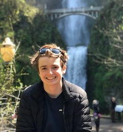

# Matthew Chute

 

## About Me:
Hello, my name is Matthew and I am a foruth year student in the [Faculty of Applied Science](http://www.sfu.ca/fas.html) at [Simon Fraser University](https://www.sfu.ca). I am majoring in Computer Engineering and known programming languages include Swift, Python, C++ and C.   

## Relevant Courses:   
CMPT 225: Data Structures and Programming (Language: C++)  
CMPT 275: Software Engineering I (Language: Swift)     
CMPT 300: Operating Systems I (Language: C)    
ENSC 350: Digital Systems Design (Language: VHDL) 
ENSC 351: Embedded and Real Time System Software (Language: C++)      

---

&nbsp;&nbsp;&nbsp;&nbsp;

